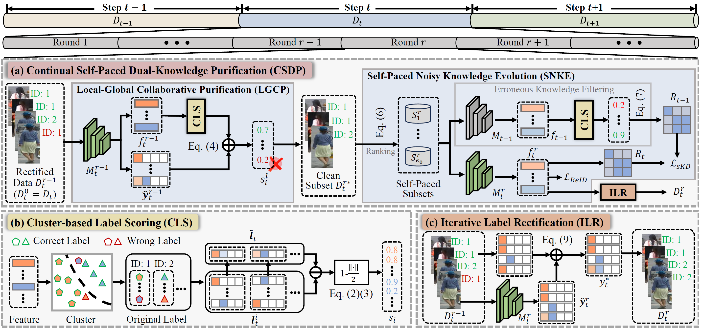
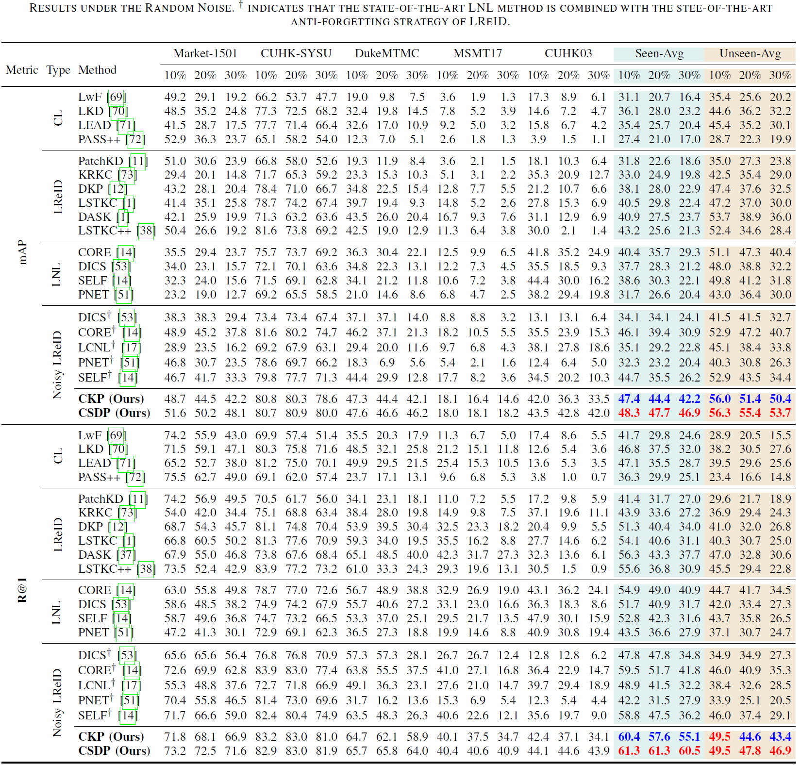

# [TPAMI 2026] Mitigate Catastrophic Remembering via Continual Self-Paced Dual-Knowledge Purification for Noisy Lifelong Person Re-Identification

<div align="center">

<div>
      Kunlun Xu<sup>1</sup>&emsp; Jiangmeng Li<sup>2</sup>&emsp; Yufei Guo<sup>3</sup>&emsp; Yuxin Peng<sup>1</sup>&emsp; Jiahuan Zhou<sup>1*</sup>
  </div>
<div>

  <sup>1</sup>Wangxuan Institute of Computer Technology, Peking University&emsp; <sup>2</sup>University of Chinese Academy of Science&emsp; <sup>3</sup>Intelligent Science & Technology Academy of CASIC

</div>
</div>
<p align="center">
  <a href="https://github.com/zhoujiahuan1991/TPAMI-CSDP">a>
</p>

The *official* repository for  [Mitigate Catastrophic Remembering via Continual Self-Paced Dual-Knowledge Purification for Noisy Lifelong Person Re-Identification](https://ieeexplore.ieee.org/abstract/document/11520946/).

## News
* 🔥[2024.09.10] The code for CKP (accepted by ACM MM 2024) is released in [CKP Code](https://github.com/zhoujiahuan1991/MM2024-CKP)!
* 🔥[2024.10.28] The full paper for DKP is publicly available in [CKP Paper](https://dl.acm.org/doi/10.1145/3664647.3681235)!
* 🔥[2026.05.15] Our improved verison DKP++ is accepted by IEEE TPAMI. The full paper is available in [CSDP Paper](https://ieeexplore.ieee.org/abstract/document/11520946)!
* 🔥[2025.06.30] The code for CSDP is released in [CSDP Code](https://github.com/zhoujiahuan1991/TPAMI-CSDP).




## Installation
```shell
conda create -n IRL python=3.9
conda activate IRL
pip install torch==1.13.1+cu117 torchvision==0.14.1+cu117 torchaudio==0.13.1 --extra-index-url https://download.pytorch.org/whl/cu117
pip install -r requirements.txt
python setup.py develop
```
## Prepare Datasets
Download the person re-identification datasets [Market-1501](https://drive.google.com/file/d/0B8-rUzbwVRk0c054eEozWG9COHM/view), [MSMT17](http://www.pkuvmc.com/dataset.html), [CUHK03](https://github.com/zhunzhong07/person-re-ranking/tree/master/evaluation/data/CUHK03), [SenseReID](https://drive.google.com/file/d/0B56OfSrVI8hubVJLTzkwV2VaOWM/view?resourcekey=0-PKtdd5m_Jatmi2n9Kb_gFQ). Other datasets can be prepared following [Torchreid_Datasets_Doc](https://kaiyangzhou.github.io/deep-person-reid/datasets.html) and [light-reid](https://github.com/wangguanan/light-reid).
Then unzip them and rename them under the directory like

```
PRID
├── CUHK01
│   └──..
├── CUHK02
│   └──..
├── CUHK03
│   └──..
├── CUHK-SYSU
│   └──..
├── DukeMTMC-reID
│   └──..
├── grid
│   └──..
├── i-LIDS_Pedestrain
│   └──..
├── MSMT17_V2
│   └──..
├── Market-1501
│   └──..
├── prid2011
│   └──..
├── SenseReID
│   └──..
└── viper
    └──..
```

 This repository includes noisy label configurations, located in the `noisy_data/` folder. Along with the noisy ratios of 0.1, 0.2, and 0.3 used in the paper, we also provide additional ratios of 0.4, 0.5, 0.6, 0.7, and 0.8 to support further investigation for the Noisy LReID community.  Note that the noisy data are generated following [PNet](https://github.com/mangye16/ReID-Label-Noise).

## Quick Start

Training on a single dataset (--noise random/pattern/clean, --noise_ratio 0.1/0.2/0.3/0.4/...):
```shell
`python continual_train_noisy.py --data-dir path/to/PRID --noise_ratio XX --noise YY`
(for example, `python continual_train_noisy.py --data-dir ../DATA/PRID --noise_ratio 0.3 --noise pattern`)
```

Reproduce the random/pattern noise results by running the bash file:

```shell
`sh release_random.sh`
`sh release_pattern.sh`
```

Evaluation from checkpoint:

```shell
`python continual_train_noisy.py --data-dir path/to/PRID --test_folder /path/to/pretrained/folder`
```

## Results
The following results were obtained with a NVIDIA 4090 GPU.




## Citation
If you find this code useful for your research, please cite our paper.
```shell
@article{xu2026mitigate,
  title={Mitigate Catastrophic Remembering via Continual Self-Paced Dual-Knowledge Purification for Noisy Lifelong Person Re-Identification},
  author={Xu, Kunlun and Li, Jiangmeng and Guo, Yufei and Peng, Yuxin and Zhou, Jiahuan},
  journal={IEEE Transactions on Pattern Analysis and Machine Intelligence},
  year={2026},
  publisher={IEEE}
}
```


### We have conducted a series of research in Lifelong Person Re-Identification as follows.

#### VLM-driven Lifelong Learning
```shell
@inproceedings{xu2026vision,
  title={Vision-Language Attribute Disentanglement and Reinforcement for Lifelong Person Re-Identification},
  author={Xu, Kunlun and Cheng, Haotong and Li, Jiangmeng and Zou, Xu and Zhou, Jiahuan},
  booktitle={Proceedings of the IEEE/CVF Conference on Computer Vision and Pattern Recognition},
  pages={40397--40406},
  year={2026}
}
```


#### Semi-Supervised Lifelong Learning
```shell
@inproceedings{xu2025self,
  title={Self-reinforcing prototype evolution with dual-knowledge cooperation for semi-supervised lifelong person re-identification},
  author={Xu, Kunlun and Zhuo, Fan and Li, Jiangmeng and Zou, Xu and Zhou, Jiahuan},
  booktitle={Proceedings of the IEEE/CVF International Conference on Computer Vision},
  pages={3564--3574},
  year={2025}
}
```

#### Image-level Distribution Modeling and Transfer:
```shell
@inproceedings{xu2025dask,
  title={Dask: Distribution rehearsing via adaptive style kernel learning for exemplar-free lifelong person re-identification},
  author={Xu, Kunlun and Jiang, Chenghao and Xiong, Peixi and Peng, Yuxin and Zhou, Jiahuan},
  booktitle={Proceedings of the AAAI Conference on Artificial Intelligence},
  volume={39},
  number={9},
  pages={8915--8923},
  year={2025}
}
```
#### Feature-level Distribution Modeling and Prototyping:
```shell
@article{zhou2025distribution,
  title={Distribution-Aware Knowledge Aligning and Prototyping for Non-Exemplar Lifelong Person Re-Identification},
  author={Zhou, Jiahuan and Xu, Kunlun and Zhuo, Fan and Zou, Xu and Peng, Yuxin},
  journal={IEEE Transactions on Pattern Analysis and Machine Intelligence},
  year={2025},
  publisher={IEEE}
}

@inproceedings{xu2024distribution,
  title={Distribution-aware Knowledge Prototyping for Non-exemplar Lifelong Person Re-identification},
  author={Xu, Kunlun and Zou, Xu and Peng, Yuxin and Zhou, Jiahuan},
  booktitle={Proceedings of the IEEE/CVF Conference on Computer Vision and Pattern Recognition},
  pages={16604--16613},
  year={2024}
}
```
#### Long Short-Term Knowledge Rectification and Consolidation:
```shell
@article{xu2025long,
  title={Long Short-Term Knowledge Decomposition and Consolidation for Lifelong Person Re-Identification},
  author={Xu, Kunlun and Liu, Zichen and Zou, Xu and Peng, Yuxin and Zhou, Jiahuan},
  journal={IEEE Transactions on Pattern Analysis and Machine Intelligence},
  year={2025},
  publisher={IEEE}
}


@inproceedings{xu2024lstkc,
  title={Lstkc: Long short-term knowledge consolidation for lifelong person re-identification},
  author={Xu, Kunlun and Zou, Xu and Zhou, Jiahuan},
  booktitle={Proceedings of the AAAI Conference on Artificial Intelligence},
  volume={38},
  number={14},
  pages={16202--16210},
  year={2024}
}
```
#### Lifelong Learning with Label Noise:
```shell 
@inproceedings{xu2024mitigate,
  title={Mitigate Catastrophic Remembering via Continual Knowledge Purification for Noisy Lifelong Person Re-Identification},
  author={Xu, Kunlun and Zhang, Haozhuo and Li, Yu and Peng, Yuxin and Zhou, Jiahuan},
  booktitle={Proceedings of the 32nd ACM International Conference on Multimedia},
  pages={5790--5799},
  year={2024}
}
```

#### Prompt-guided Adaptive Knowledge Consolidation:
```shell
@article{li2024exemplar,
  title={Exemplar-Free Lifelong Person Re-identification via Prompt-Guided Adaptive Knowledge Consolidation},
  author={Li, Qiwei and Xu, Kunlun and Peng, Yuxin and Zhou, Jiahuan},
  journal={International Journal of Computer Vision},
  pages={1--16},
  year={2024},
  publisher={Springer}
}
```

#### Compatible Lifelong Learning:
```shell
@inproceedings{cui2024learning,
  title={Learning Continual Compatible Representation for Re-indexing Free Lifelong Person Re-identification},
  author={Cui, Zhenyu and Zhou, Jiahuan and Wang, Xun and Zhu, Manyu and Peng, Yuxin},
  booktitle={Proceedings of the IEEE/CVF Conference on Computer Vision and Pattern Recognition},
  pages={16614--16623},
  year={2024}
}
```

## Acknowledgement
Our LReID code is based on [LSTKC](https://github.com/zhoujiahuan1991/AAAI2024-LSTKC) and [CORE](https://github.com/mangye16/ReID-Label-Noise).

## Contact

For any questions, feel free to contact us (xkl@stu.pku.edu.cn).

Welcome to our Laboratory Homepage ([OV<sup>3</sup> Lab](https://zhoujiahuan1991.github.io/)) for more information about our papers, source codes, and datasets.

